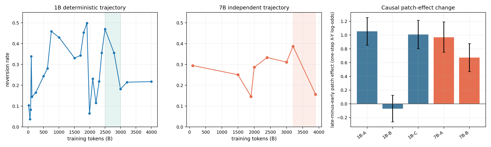
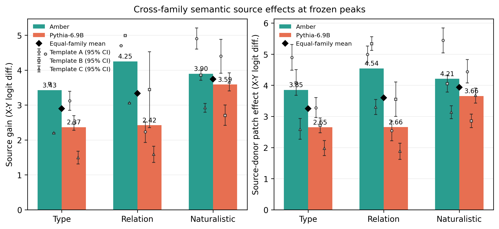

# Non-monotonic source reversion across language-model pretraining checkpoints: behavioral trajectories and source-position residual interventions

**Authors:** [Author names and affiliations to be supplied]

**Corresponding author:** [Name, email, and affiliation to be supplied]

## Abstract

Whether a language model continues to follow explicit evidence during training
is often reported primarily at a final checkpoint. We trace candidate choices
across checkpoints and test local residual replacement. Conflict prompts state
counterfactual `X` while a parametric prior favors `Y`; corrupt controls replace
`X` with `Z`. Across 24 OLMo-2 1B checkpoints, the largest observed low-high-low
prior-choice reversion excursion is 0.434 (95% CI [0.362, 0.523]); a separate
eight-checkpoint 7B release shows 0.230 (95% CI [0.158, 0.298]). At the selected
1B transition, the \(p_X,p_Y,p_{\mathrm{other}}\) decomposition changes from
(0.390, 0.470, 0.140) to (0.762, 0.182, 0.056); the 7B decomposition is
concordant (Table 3).
Early-depth source-donor patch effects increase
by +1.054 [0.854, 1.255] and +1.008 [0.802, 1.215] single-token X-Y
logit-difference units for two of three 1B templates; corresponding 7B changes
are +0.968 [0.752, 1.191] and +0.672 [0.469, 0.877]. At prespecified frozen
semantic peaks, conditional descriptive summaries from the gated suite are
positive across type/category,
relation/slot, and naturalistic axes in Amber-7B and Pythia-6.9B. The results
identify a bounded source/prior reversion pattern and a causal effect of
residual replacement at the tested source position. Nontrivial Pythia
random-residual controls leave source-content specificity unresolved; no
universal training phase is established.

**Keywords:** language models; training dynamics; contextual faithfulness;
knowledge conflict; activation patching; mechanistic interpretability

## 1. Introduction

Language models are often asked to answer from an explicit passage while also
carrying a parametric prior acquired during pretraining. When the passage and
the prior disagree, an output can be fluent and plausible while failing to
follow the evidence that was supplied in the prompt. This distinction is
central to faithfulness evaluation in generation [1] and to recent studies of
contextual knowledge conflict [2,3]. It is also a training question: a model's
final behavior need not reveal whether source use was present, lost, or
recovered earlier in the optimization trajectory.

Public checkpoint suites make this question measurable. Pythia was released
with models trained on the same data order and many intermediate checkpoints
[4], while OLMo and OLMo 2 provide open weights, training information, code,
and intermediate checkpoints [5,16]. Earlier work on delayed generalization
and mechanistic progress measures shows why a single score can hide gradual or
non-monotonic changes [6,7]. Recent work now also traces parametric and
in-context preference during pretraining, including Pythia checkpoints and an
OLMo-7B appendix [17]. We therefore ask a narrower unresolved question: can a
controlled explicit-source conflict show a low--high--low reversion excursion
within an unmodified OLMo-2 trajectory, and does a selected behavioral change
have a local causal activation effect?

Behavior alone is not enough to identify source transmission. A representation
may contain information that a model does not use for its output, and a probe
can measure availability without establishing behavioral influence [8]. Recent
work on latent knowledge and truthfulness likewise reports dissociations
between internal encoding and generated answers [9-11]. Causal mediation and
activation-patching methods address this distinction by replacing an
intermediate activation and measuring the resulting output change [12-15]. The
intervention still has to be defined locally: a source-token patch can test the
causal effect of replacing the intervened residual on a specified margin, but it
does not by itself identify a complete circuit or explain why a training
transition occurs.

We study these questions with a matched source-reversion task and a
source-position residual intervention. The conflict prompt states a
counterfactual answer `X` while the catalogued factual answer `Y` serves as the
parametric candidate; its source-erased preference is measured directly. A
matched corrupt prompt replaces only the source answer with `Z`. We first trace
reversion across OLMo-2 1B and 7B checkpoints. We then patch the clean `X`
source-token residual into the corrupt run at each decoder block. Finally, at
frozen semantic peaks selected by the independent-family gate, we test
type/category, relation/slot, and naturalistic context axes in Pythia-6.9B and
Amber-7B, with prespecified deterministic item-key halves and donor controls.

The paper makes three primary contributions. First, it quantifies a reproducible
low--high--low trajectory of parametric-prior reversion and verifies that the
corresponding source-choice proportion moves in the opposite direction rather
than being explained by distractor choices. Second, it measures a causal
change in the effect of replacing the answer-bearing source-position residual
at selected transitions. Third, it tests the same source-versus-corrupt
construction at three semantic axes in two independently trained families at
frozen checkpoints. We additionally report the failed pre-final
predictor/steering gate rather than converting an exploratory correlation into a
control method.
The resulting claim is intentionally bounded: it concerns the tested
checkpoints, prompts, source positions, and interventions, not a universal
phase boundary or a general law of language-model training.

## 2. Related work

### 2.1 Faithfulness and contextual knowledge conflict

Faithfulness is commonly defined relative to an input document or source: an
answer should be supported by the supplied evidence rather than hallucinated
from unrelated model knowledge [1]. In language models, the analogous failure
appears when parametric knowledge competes with an explicit context. Zhou et al.
show that prompting can improve context use in such conflicts [2], and Xie et
al. provide a controlled study of how model behavior varies with the coherence
and strength of external evidence [3]. Kim et al. [17] recently traced
parametric and in-context preference during pretraining and showed that the two
source preferences need not exhaust all outputs. Our source-reversion analysis
uses candidate-string scoring to ask whether the source/prior choice balance can
move in both directions within an unmodified OLMo-2 trajectory; the causal
follow-up then uses a one-token source/corrupt contrast and a local residual
intervention.

### 2.2 Training dynamics and checkpoint-wise analysis

The Pythia release was designed for studies of how language models develop
across training and scale [4]. OLMo and OLMo 2 similarly make intermediate
model states available for scientific analysis [5,16]. Work on grokking demonstrates that
generalization can occur after apparent memorization [6], and Nanda et al.
show that mechanistic progress measures can expose continuous changes beneath
an abrupt behavioral curve [7]. We use this perspective as a methodological
analogy, not as evidence that the present source-reversion curve has the same
algorithmic phases as modular arithmetic. In particular, the current data do
not justify a universal three-phase description. She et al. [19] likewise show
that linear steerability can emerge at intermediate checkpoints and vary across
concepts and model families; our failed prospective gate and local patching
analysis address a different source-versus-corrupt margin and do not assume
that steerability is a reliable predictor.

### 2.3 Representations, behavior, and causal interventions

Amnesic probing formalized the distinction between information present in a
representation and information that contributes to a task decision [8].
Latent-knowledge work similarly asks what a model encodes when its generated
answer is wrong [9-11]. Causal mediation, causal tracing, and interchange
interventions go further by modifying an internal variable and measuring an
output counterfactual [12-14]. Activation-patching best-practice work stresses
that corruption choice, metric, and intervention geometry can change the
interpretation [15]. Makelov et al. [20] further show that subspace patches can
produce an end-to-end effect without uniquely identifying the intended feature.
Our design follows these lessons by requiring an exactly
one-token clean/corrupt difference, retaining the corrupt donor as a no-op
control, and reporting wrong-position and norm-matched random-residual donors
separately.

### 2.4 Position of the present study

The contribution is the combination of three elements: a checkpoint-wise
source-reversion trajectory with an explicit X/Y/other decomposition, a
source-position intervention at selected training transitions, and a
frozen-peak semantic suite with explicit falsification checks. This differs in
question and intervention from recent work on training-data factors and
source-preference curves [17]. The ingredients are combined to provide a
reproducible empirical account of how an explicit source affects a measured
answer margin under a controlled conflict construction; source reversion is
treated as that candidate-choice construct rather than as a synonym for
factuality, truthfulness, or general reasoning.

## 3. Experimental design

### 3.1 Source-reversion task and metrics

Each primary item is a factual tuple with a subject, a source-stated answer,
and a candidate list. In a conflict prompt, the passage asserts a
counterfactual answer `X`, while the model's parametric knowledge is evaluated
against the catalogued answer `Y`. The candidate list also contains
distractors. A matched
source-erased prompt removes the answer-bearing statement and supplies a
continuous prior-strength diagnostic. A neutral prompt uses a fictional or
otherwise prior-minimized subject without a catalogued factual prior while retaining the same source-answer
construction. The pilot item generator also defines an agree condition, but no
agree measurements are part of the canonical OLMo trajectory or semantic
confirmation runs; it is not used as evidence below.

The information flow is therefore:

```text
Parametric prior: Y    Clean source: X    Corrupt source: Z
Candidate set: X, Y, and distractors
```

Only the source answer changes between the clean and corrupt prompts in the
causal runs; the candidate set and query remain fixed.

For the primary identity axis, we score the candidate strings with
length-normalized autoregressive log likelihood. Let \(\ell_c(a)\) and
\(\ell_e(a)\) denote the candidate score under conflict and source-erased
prompts. The reversion indicator is

\[
 r_i = \mathbf{1}\{\arg\max_a \ell_c(a)=Y_i\},
\]

so a higher reversion rate means more frequent selection of the parametric
prior. Because distractors can win, a lower reversion rate is not by itself a
source-faithfulness rate. We therefore also report

\[
 p_X = \Pr(\arg\max_a \ell_c(a)=X),\quad
 p_Y = \Pr(\arg\max_a \ell_c(a)=Y),\quad
 p_{\mathrm{other}}=1-p_X-p_Y.
\]

The source-choice proportion \(p_X\) is the direct candidate-level readout of
source following; \(p_{\mathrm{other}}\) records distractor choices rather
than silently assigning them to either source. We also report the conflict
margin \(m_c=\ell_c(X)-\ell_c(Y)\), the erased margin
\(m_e=\ell_e(X)-\ell_e(Y)\), and the source contribution
\(d_m=m_c-m_e\). A descriptive prior-strength quantity is the erased score of
`Y` relative to the distractor mean. These continuous quantities are not
treated as causal predictors.

The template-level behavioral audit and the causal batch additionally retain
the pairwise Y-over-X error \(e_{YX}=\mathbf{1}\{m_c<0\}\). This indicator compares only
`X` and `Y`; it can disagree with `r_i` when a distractor is the
top-scoring candidate. We label it explicitly wherever those template or
causal-batch values are reported.

Candidate scores are autoregressive log-likelihoods for the continuation
`" " + candidate`, with no appended end-of-sequence token, divided by the
number of continuation tokens (and by one for an empty continuation). The
primary identity trajectory therefore uses normalized log-likelihood
differences in nats per continuation token; candidates are not required to be
single tokens in this trajectory. The source-position causal batch separately
filters `X`, `Y`, and `Z` to one first-answer token. Its final-token logit
difference is numerically the corresponding one-step log-odds (nats), but it is
not the same estimator as the length-normalized trajectory score. The candidate
menu is scored in the same answer slot for the conflict and erased prompts;
tokenizer revisions are pinned in the run manifests.

Randomized roster tags are presentation-only. They remain in the prompt
context, but are excluded from every scored continuation: the scorer appends
only `" " + candidate` (or, in the one-token causal batch, scores the answer
token itself). Thus tag identity cannot contribute token likelihood to a
candidate score.

For the primary identity bank, the generator samples 40 matched
conflict/erased pairs in each of two categories (`loc`, `auth`) and two fame
strata (160 rows per checkpoint). The factual banks contain 16 location and 12
authorship facts; repeated samples collapse to 121 unique
(`category`, `subject`, `X`, `Y`) clusters for statistical inference and
bootstrap resampling. In a conflict pair, `Y` is the catalogued factual answer
used as the prior candidate; the source-erased prompt measures how strongly the
checkpoint favors that candidate rather than assuming a strong prior for every
item. `X` is a distinct same-type counterfactual, `Z` is a third same-type
candidate for the corrupt prompt, and the fourth menu entry is a filler.
Candidate order and per-item tags are randomized by the recorded generator
stream. The primary fact banks are frozen in `pilot/gen_items.py` (`LOC_FACTS`,
`AUTH_FACTS`, and their candidate pools); no model output is used to choose the
primary trajectory items. The source-erased prompt keeps the same roster but
removes the answer statement, while the neutral diagnostic uses a fictional
subject.

For example, one rendered primary pair is:

```text
Options: <r3> Austen, <p3> Dante, <y7> Orwell, <q7> Shakespeare.
In this document, Pride and Prejudice was written by Dante.
According to the document, Pride and Prejudice was written by
```

The matched erased version replaces the second line with “The document does
not provide this information.” and keeps the roster and answer stem unchanged.
Three frozen paraphrase templates (A, B, and C) alter the source wording but
preserve the candidate menu, answer, and query. For the causal runs, the
rendered clean and corrupt prompts are required to have identical token length
and exactly one different source-answer token.

### 3.2 Checkpointed models and transition selection

Table 1 summarizes the checkpoint inventory. OLMo-2 1B is the
`allenai/OLMo-2-0425-1B` stage-1 trajectory with 24 checkpoints spanning 21B
to 4001B training tokens. OLMo-2 7B is the independent
`allenai/OLMo-2-1124-7B` stage-1 trajectory with eight checkpoints spanning
101B to 3896B tokens. The exact released model cards and revisions are recorded
for the 1B and 7B checkpoints [21,22]. Models are evaluated without task
fine-tuning, in bfloat16 inference mode.

The full OLMo-2 curves use the single reference renderer from the primary
generator (`gen_items.generate_pairs` followed by `prior_law.run_one`), with
the 24-checkpoint `checkpoints_all.json` manifest for 1B and the eight-checkpoint
7B manifest. They are not averages of the three paraphrase templates. Templates
A--C are introduced only in the transition-level behavioral and causal audits
after the trajectory checkpoints have been selected; their rows therefore test
prompt robustness and intervention behavior rather than define the full curves.

For the two independent-family screens, the scalar gate is computed before any
semantic confirmation from the same all-candidate reversion rate on 12 fixed
coarse identity checkpoints. For every interior checkpoint, the analyzer
selects the minimum reversion among earlier checkpoints and the minimum among
later checkpoints, and retains the triplet maximizing the smaller of the two
rises. A family passes only when a triplet exists, its observed excursion is at
least 0.10, the lower endpoint of its 10,000-draw item-cluster bootstrap
interval is greater than 0.05, and both deterministic SHA-256 item-key halves
have excursions of at least 0.05. The Pythia coarse axis contains 0, 2, 4, 8,
17, 34, 67, 101, 134, 201, 252, and 300 billion-token labels; the Amber axis
contains the 12 public ordinals 0, 8, 16, 32, 64, 96, 128, 176, 224, 272,
320, and 358. Amber labels are ordinal checkpoints, not token counts. Once a
family passes, its before/peak/after revisions are frozen and reused for all
three semantic axes; no semantic axis selects a new peak. The gate is a
screening rule, not a hypothesis test, and checkpoints are not independent
statistical replicates.

The trajectory summary defines the excursion of a curve as the largest value
of

\[
 \min\{r(t_p)-r(t_b),\;r(t_p)-r(t_a)\}
\]

over an earlier trough \(t_b\), an interior peak \(t_p\), and a later trough
\(t_a\). The maximum was selected from the observed curve. For each item-cluster
bootstrap draw, the same extrema search is rerun on the resampled curve, so the
interval describes the data-selected statistic rather than a confirmatory
hypothesis test. The deterministic rerun uses the corrected generator and
confirms that the trajectory is not a hash-seed artifact.

The 1B causal event is the late 2496B-to-2999B transition. The global maximum
excursion occurs earlier, from 63B through 1909B to 1993B, but the early
1909B-to-1993B drop is not template-general. The late event is therefore the
primary intervention transition because all three frozen templates show a
positive pairwise Y-over-X error drop. The 7B intervention transition follows
the recorded transition-selection rule and is the 3201B-to-3896B source-choice
transition; template C is retained in the behavioral audit but is not included
in the 7B causal batch because its behavioral change has a confidence interval
containing zero.

For the independent-family semantic suite, Pythia-6.9B uses public checkpoint
steps 16000, 32000, and 64000 (axis labels 34B, 67B, and 134B) for the
pre/peak/post confirmation. Amber-7B uses public LLM360 ordinal checkpoints
`ckpt_008`, `ckpt_096`, and `ckpt_272`. Amber ordinals are labels only; no
training-token count is imputed. The semantic axes are evaluated at these
frozen peaks rather than traced as full semantic trajectories.

**Table 1. Checkpoint inventory and item accounting.** Amber checkpoint labels
are ordinals; no token count is inferred for that release. Behavior and patch
counts refer to each semantic condition unless otherwise stated.

| Model or suite | Checkpoints used | Checkpoint unit | Item accounting | Purpose |
|---|---:|---|---|---|
| OLMo-2 1B | 24 | training tokens, 21--4001B | 3,840 rows; 121 unique item clusters | deterministic reference trajectory |
| OLMo-2 7B | 8 | training tokens, 101--3896B | 1,280 rows; 121 unique item clusters | cross-scale corroboration in a separate release |
| Pythia-6.9B | 12 coarse; 3 semantic confirmation | public training-token labels for coarse identity suite; 34/67/134B for confirmation | 120 behavior or 60 patch items per semantic condition | independent family gate and semantic suite |
| Amber-7B | 12 coarse; 3 semantic confirmation | LLM360 ordinal; `ckpt_008/096/272` | 120 behavior or 60 patch items per semantic condition | independent family gate and semantic suite |

### 3.3 Source-token activation patching

For every matched causal item, the clean prompt contains source answer `X` and
the corrupt prompt changes only that source token to `Z`; the candidate `Y`
remains unchanged. We run the clean prompt once with hidden states returned,
run the corrupt prompt to obtain its unpatched margin, and identify the unique
source-token position after rendering each template. At decoder block \(l\),
we replace the residual vector at that position in the corrupt run with the
clean vector from the same position and layer. In the Hugging Face outputs used
here, `hidden_states[0]` is the embedding output and
`hidden_states[k+1]` is the residual stream returned after decoder block `k`.
Thus the 1B early-depth summary uses tensor indices 1--12 (blocks 0--11), and
the 7B summary uses indices 1--24 (blocks 0--23). This first-75%-of-blocks
window is fixed in the patch summary to compare normalized depths across the
two OLMo releases; it is a pre-final feature-range convention rather than a
transition-specific layer selection. The complete layer curves remain in the
intervention readout.

\[
 q_l = [\ell_l^{\mathrm{patch}}(X)-\ell_l^{\mathrm{patch}}(Y)]
       -[\ell^{\mathrm{corrupt}}(X)-\ell^{\mathrm{corrupt}}(Y)].
\]

Thus \(q_l\) is the patch-induced X-versus-Y margin shift relative to the
corrupt baseline. It is not bounded by the clean-minus-corrupt margin and can
therefore overshoot the clean run. Because `X` and `Y` are single-token
answers in this batch, \(q_l\) is a final-token logit-difference (one-step
log-odds) unit. The primary OLMo transition statistic averages \(q_l\) over
blocks 0--11 of the 16-layer 1B model or blocks 0--23 of the 32-layer 7B model,
then compares the later and earlier checkpoints on paired items.

The nominal causal batches contain 120 rows for 1B and 60 rows for 7B. Conflict
batches include repeated draws with the same five-field pair key
(`category`, `subject`, `X`, `Z`, `Y`); the canonical paired analyzer indexes
these rows by that key, giving 116 unique keys for each 1B conflict comparison
and 57 for each 7B comparison. Neutral batches contain 120 and 60 unique keys,
respectively. The duplicate-key collapse is fixed by the analysis code and is
not based on the observed effect or checkpoint; it explains why the paired
estimand can have a smaller \(n\) than the nominal file. The source donor is
accompanied by a corrupt donor, which copies the corrupt hidden state and is an
exact no-op under the implementation. The semantic suite
also uses an adjacent clean token as a wrong-position donor and a deterministic
norm-matched random residual at the true source position. The latter controls
for vector scale but can still produce output changes; it is therefore reported
as a diagnostic rather than collapsed into a null. The semantic summary reports
the mean of each item's maximum layer shift across all layers; this item-wise
peak-layer statistic is descriptive and is not directly interchangeable with
the fixed early-depth mean used for the OLMo transition comparison. The current artifact does not
include a mismatched natural clean donor or a multi-draw random-donor
distribution, so the controls identify positional sensitivity more strongly
than source-content specificity.

### 3.4 Semantic transfer axes

The semantic suite keeps the source-versus-corrupt construction fixed while
changing the semantic role of the answer.

* **Type/category:** the passage assigns a counterfactual type to a known
  entity; item-key halves are assessed separately in the semantic-half check.
* **Relation/slot:** the passage specifies a relation such as headquarters,
  inventor, birthplace, currency, or language, with relation families and
  subject identities varied across the item bank.
* **Naturalistic context:** a two-to-four sentence profile or mini-report
  contains the evidence sentence, aliases, connectives, and distractor
  details; the query asks for a named location or author slot.

Each axis has three templates, a frozen 50/50 partition of the semantic item
keys, and tokenizer-aware candidate construction. The runner stores each key as
`axis:category:subject:Y`; for conflict rows this identifies the underlying
subject/catalogued-answer fact, while for neutral rows it identifies the frozen
fictional-subject/candidate tuple. `analyze_semantic.py` averages repeated rows
sharing this key before bootstrap resampling. The split is a deterministic hash
of the same key, not a complete category holdout: both prespecified halves are
used as robustness checks and in the gate, rather than serving as independent
test sets. All answers `X`, `Y`, and `Z` are single first-answer tokens and the
clean/corrupt pair differs at exactly one source token. The confirmation suite
uses 120 behavior items and 60 patch items per axis, template, and item mode.
Conflict and neutral modes are both retained. The analysis specification fixes
the two families, three axes, three templates, item split, and pre/peak/post
checkpoints before confirmation; the item bank is frozen after tokenizer and
schema preflight. No model-based prior-strength threshold or outcome-based
item exclusion is applied.
Each family-axis input contains the full prespecified matrix, and all inputs in
the pooled artifact were retained rather than removed based on effect direction.
The semantic preflight is a tokenizer/schema smoke check, not a separate
model-based capability filter. `run_semantic_preflight.sh` evaluates 16 items
per axis and mode at one frozen revision using template A for the smoke score;
the shared item builder validates one-token `X`, `Y`, and `Z` answers and the
single clean/corrupt token difference across templates A--C. It rejects
malformed or tokenizer-incompatible items but does not apply a prior-strength
threshold and does not discard rows according to source gain, patch effect, or
any other observed outcome. Accordingly, the confirmation gate has no hidden
capability or prior-strength cutoff: it requires complete coverage/schema,
at least two of three peak conflict templates with a positive lower 95%
confidence bound for source gain, both deterministic item-key halves positive
for at least two templates, at least two templates with a positive lower bound
for the source-position patch effect, and an exact corrupt-donor no-op within
`1e-9`.
Because these quality gates and the pooled summaries use the same confirmation
files, the pooled values are conditional descriptive summaries, not independent
confirmatory tests.

The semantic item builders use frozen fact banks: 19 type facts across three
entity categories, 28 relation facts across five relation categories, and the
28 location/authorship facts inherited by the naturalistic axis. In conflict
items, the fact-bank answer supplies `Y`; distinct tokenizer-valid pool entries
are sampled for `X`, `Z`, and the filler. Neutral items use a fictional subject
and sample all four candidates from the valid pool. Candidate order is
randomized, and the preflight freezes the bank after tokenizer/schema checks;
no model-based prior-strength threshold is applied and no confirmation row is
screened by its observed effect. The frozen semantic banks and builder are
recorded in `semantic_items.py`; the same renderer is used for behavior, source
patching, and controls,
so each semantic condition preserves the source/corrupt one-token contrast.

The two independent families are Amber-7B (`IFM/Amber`) [18] and
Pythia-6.9B (`EleutherAI/pythia-6.9b-deduped`) [4]. The pooled artifact gives
equal weight to families and then equal weight to templates within each
family. Model checkpoints are not independent statistical subjects. Each
family contributes 36 peak control files for the three axes, three templates,
two item modes, and two non-source donor modes; separate corrupt-donor files
are retained for every axis and mode.

### 3.5 Statistical analysis and reproducibility

Trajectory uncertainty is obtained by resampling the 121 unique item clusters
with replacement for 10,000 draws. A supplementary sensitivity analysis
reweights the same rows by the 28 factual `(category, subject, Y)` clusters and
repeats the extrema search and patch summaries with 10,000 fact-cluster draws
(full results in `CLUSTER-SENSITIVITY.md`). Fixed item-key halves use a SHA-256
split of the same key; they are deterministic robustness partitions, not
independent held-out test sets. Primary causal transition intervals use paired
item bootstrap over the matched rows and 10,000 draws. The semantic summaries
use the machine-readable 4,000-draw bootstrap over the explicit
`axis:category:subject:Y` key defined by `analyze_semantic.py`, averaging
repeated rendered rows before resampling, and report family/template confidence
checks rather than pseudo-replicating checkpoints.

The prospective predictor analysis was frozen as a gate before the final
intervention decision; it was not preregistered. It evaluates
checkpoint-by-template groups and reports Bonferroni-adjusted p-values for the
36 pre-final layer, logit, attention, and source-routing tests using the full
48-test family; a post-hoc layer-13 result is included in that 48-test family.
A failed gate is retained as a negative result and does not trigger a targeted
intervention.

The initial item generator used unordered set iteration for randomized roster
identifiers. The deterministic repair preserves random-number-generator order,
and a cross-process prompt-hash check gives identical rendered prompts. The
semantic runs used a pinned container, disjoint job outputs, and a verified
checksum inventory. Full hashes, image metadata, machine provenance, and the
723-entry inventory are provided in the supplementary reproducibility note.
These provenance checks validate the frozen artifacts; they do not turn
data-selected extrema into fixed confirmatory tests.

## 4. Results

### 4.1 Explicit-source reversion is non-monotonic within OLMo-2 trajectories

We first asked whether source reversion could increase and later decrease
within one uninterrupted pretraining trajectory. Figure 1 (left) and Figure S1
show the deterministic OLMo-2 1B curve across 24 checkpoints. The largest
observed excursion is 0.434, with item-cluster bootstrap 95% CI [0.362,
0.523]. The corresponding data-selected extrema are 63B (before), 1909B
(peak), and 1993B (after). The deterministic item halves give excursions
0.439 and 0.462, and the full rerun contains 3,840 rows from 121 unique item
clusters. The result is therefore not dependent on one half of the item bank
or on the corrected generator's process hash seed.

The maximum excursion is not the transition used for the causal headline. The
early 1909B-to-1993B pairwise Y-over-X error drop is positive for template A,
+0.466 [0.379, 0.560],
but is negative for template B, -0.095 [-0.172, -0.017], and near zero for
template C, +0.009 [-0.078, 0.103]. The later 2496B-to-2999B pairwise
Y-over-X error drop is positive for all three templates: A, 0.336 [0.250,
0.431]; B, 0.138 [0.060, 0.216]; and C, 0.397 [0.302, 0.491]. We use this
later event as the primary
within-trajectory transition because it is the template-robust event in the
recorded template check.

**Table 2. OLMo-2 trajectory excursions.** The extrema are the maximum
observed excursion from the audited curve; intervals are item-cluster
bootstrap summaries and are not confirmatory tests of a data-selected maximum.

| Model | Before | Peak | After | Excursion | 95% bootstrap CI | Unique items |
|---|---:|---:|---:|---:|---|---:|
| OLMo-2 1B | 63B | 1909B | 1993B | 0.434 | [0.362, 0.523] | 121 |
| OLMo-2 7B | 1901B | 3201B | 3896B | 0.230 | [0.158, 0.298] | 121 |



*Figure 1. OLMo-2 checkpoint-wise source reversion and selected source-position
residual-replacement effects. The left and middle panels show the 1B and
separate-release 7B trajectories on a common reversion-rate scale; both full
curves use the single reference renderer rather than an average of templates
A--C. The right panel shows the change in early-depth source-donor patch effect
at the audited transitions, where A--C are transition-level prompt audits.
Shaded regions mark the selected late 1B and 7B transitions used for the
transition-level audits. Absolute patch effects and paired change intervals are
reported in Table 4.*

The candidate decomposition shows that the template-robust late event is an
exchange between the explicit source and the parametric answer, not merely a
change in distractor choices. For 1B, `p_X` rises from 0.390 to 0.762
(change +0.372, 95% CI [0.280, 0.461]) while `p_Y` falls from 0.470 to
0.182 (change -0.288, [-0.382, -0.194]); `p_other` falls from
0.140 to 0.056 (change -0.084, [-0.145, -0.026]). At 7B, `p_X` rises from
0.366 to 0.722 (change +0.355, [0.274, 0.438]) while `p_Y` falls from 0.387
to 0.157 (change -0.230, [-0.307, -0.156]); `p_other` falls from
0.247 to 0.121 (change -0.125, [-0.194, -0.061]). Figure S2 shows the full
decomposition across all checkpoints; the complete point estimates and
item-cluster bootstrap intervals are in `choice_decomposition_1b.json` and
`choice_decomposition_7b.json`.

The source-erased diagnostics indicate that the competing prior remains
present at the selected events. The erased prior-strength summary changes from
6.123 to 6.288 normalized log-likelihood units across the 1B late transition
and from 3.324 to 3.302 across the 7B transition. The erased X-minus-Y margin
`m_e` is -6.192 to -6.384 for 1B and -3.436 to -3.285 for 7B, while the source
contribution `d_m` changes from 6.281 to 7.877 and from 3.444 to 4.249,
respectively. These continuous diagnostics are descriptive; they are not used
to redefine the top-choice decomposition.

**Table 3. Candidate-choice decomposition at the selected transitions.** Each
entry is the mean over the 121 unique item clusters. `p_X` and `p_Y` are
the proportions whose top-scoring candidate is the explicit source or
parametric answer, respectively; `p_other` is the distractor
proportion.

| Model | Checkpoint | `p_X` | `p_Y` | `p_other` |
|---|---:|---:|---:|---:|
| OLMo-2 1B | 2496B | 0.390 | 0.470 | 0.140 |
| OLMo-2 1B | 2999B | 0.762 | 0.182 | 0.056 |
| OLMo-2 7B | 3201B | 0.366 | 0.387 | 0.247 |
| OLMo-2 7B | 3896B | 0.722 | 0.157 | 0.121 |

### 4.2 The pattern recurs at 7B without an observed shared token boundary

The independent OLMo-2 7B trajectory provides cross-scale corroboration in a
separate release with eight checkpoints. Its largest observed excursion is
0.230, with 95% CI [0.158,
0.298], spanning 1901B, 3201B, and 3896B. At the selected 3201B-to-3896B
transition, the template audit uses a pairwise Y-over-X error indicator
`1{m_c<0}`, rather than the all-candidate top-choice reversion used for the
trajectory. The raw endpoint rates are computed over the nominal 120 rows;
after key-indexing, 116 paired keys are available for the checkpoint contrast.
Using those paired keys, the paired error decreases by 0.224 [0.129, 0.319]
for template A and by 0.164 [0.086, 0.241] for template B.
Template C changes by 0.069 [-0.026, 0.164], so the 7B template audit is
partial rather than universal. Raw endpoint rates are retained in the
canonical summary; they are not used as the paired estimand, so endpoint
subtraction need not equal the paired change. The 116 template-audit and 57
causal-batch counts arise from the fixed five-field duplicate-key aggregation
described in Methods, not from outcome-based filtering.

The relative timing is not shared across the two OLMo releases. Progress-aligning
the 1B curve to the 7B checkpoints gives a descriptive Spearman \(\rho=-0.048\).
Because this comparison uses only eight sparsely sampled, serially dependent
checkpoints after alignment, we do not treat the rank correlation as an
inferential test of a shared boundary. No shared token-aligned timing was
detected across the two trajectories; their sampling does not support
estimating a common boundary or a scale law.

### 4.3 Source-token patching changes the output margin at selected transitions

The behavioral source-choice change could arise from a change elsewhere in the
prompt or from an output-layer reweighting that leaves source transmission
unchanged. We therefore measured the effect of restoring the clean source-token
residual in the corrupt run. Table 4 reports the absolute early-depth mean
patch effects at both checkpoints and their paired change from the
high-reversion checkpoint to the low-reversion checkpoint.

\newpage

**Table 4. Absolute and change in early-depth source-donor patch effect at the
selected transitions.** \(q_{\mathrm{early}}\) and \(q_{\mathrm{late}}\) are the
early-depth mean patch effects at the earlier and later checkpoints;
\(\Delta q=q_{\mathrm{late}}-q_{\mathrm{early}}\).
All effects are single-token X-minus-Y logit-difference (one-step log-odds)
units. Bracketed intervals for \(q_{\mathrm{early}}\) and \(q_{\mathrm{late}}\)
are item-bootstrap 95% confidence intervals; bracketed intervals for \(\Delta q\)
are paired item-bootstrap intervals over the common rows. Absolute q means use
the available
matched rows (116 for conflict and 120 for neutral in the 1B batch; 57 and 60,
respectively, in the 7B batch). “Neutral” is a matched prior-minimized diagnostic,
not a second conflict endpoint.

| Model/mode | Template | Checkpoints | \(q_{\mathrm{early}}\) [95% CI] | \(q_{\mathrm{late}}\) [95% CI] | \(\Delta q\) [95% paired CI] |
|---|---|---|---:|---:|---:|
| OLMo-2 1B / conflict | A | 2496B → 2999B | 2.346 [2.048, 2.646] | 3.401 [3.105, 3.700] | +1.054 [0.854, 1.255] |
| OLMo-2 1B / conflict | B | 2496B → 2999B | 3.034 [2.783, 3.290] | 2.964 [2.759, 3.175] | -0.071 [-0.261, 0.125] |
| OLMo-2 1B / conflict | C | 2496B → 2999B | 2.264 [2.005, 2.531] | 3.273 [2.997, 3.559] | +1.008 [0.802, 1.215] |
| OLMo-2 1B / neutral | A | 2496B → 2999B | 3.105 [2.827, 3.385] | 4.389 [4.139, 4.643] | +1.284 [1.095, 1.470] |
| OLMo-2 1B / neutral | B | 2496B → 2999B | 3.284 [3.018, 3.566] | 3.264 [3.057, 3.476] | -0.020 [-0.221, 0.180] |
| OLMo-2 1B / neutral | C | 2496B → 2999B | 2.805 [2.563, 3.046] | 3.483 [3.254, 3.710] | +0.677 [0.474, 0.888] |
| OLMo-2 7B / conflict | A | 3201B → 3896B | 0.849 [0.623, 1.084] | 1.817 [1.564, 2.082] | +0.968 [0.752, 1.191] |
| OLMo-2 7B / conflict | B | 3201B → 3896B | 1.986 [1.754, 2.219] | 2.658 [2.368, 2.954] | +0.672 [0.469, 0.877] |
| OLMo-2 7B / neutral | A | 3201B → 3896B | 1.361 [1.117, 1.607] | 2.655 [2.305, 3.028] | +1.295 [1.034, 1.569] |
| OLMo-2 7B / neutral | B | 3201B → 3896B | 2.243 [1.985, 2.510] | 2.742 [2.441, 3.045] | +0.499 [0.299, 0.694] |

For OLMo-2 1B, the absolute conflict patch effects for template A are 2.346
[2.048, 2.646] and 3.401 [3.105, 3.700] at the earlier and later checkpoints,
respectively; template C has 2.264 [2.005, 2.531] and 3.273 [2.997, 3.559].
Their paired changes are +1.054 [0.854, 1.255] and +1.008 [0.802, 1.215].
Template B changes from 3.034 [2.783, 3.290] to 2.964 [2.759, 3.175]
(\(\Delta q=-0.071\), [-0.261, 0.125]). The transition is therefore positive
for two templates and null for the third. In particular, template B shows a
behavioral source-choice return without an increased patch effect, so the local
intervention is not a uniform mediator of the observed behavioral change. The
7B result is positive for both tested templates: 0.849 [0.623, 1.084] to 1.817
[1.564, 2.082] (\(\Delta q=+0.968\), [0.752, 1.191]) for A and 1.986 [1.754,
2.219] to 2.658 [2.368, 2.954] (\(\Delta q=+0.672\), [0.469, 0.877]) for B.

A supplementary fact-cluster sensitivity analysis gives the same qualitative
pattern after giving each `(category, subject, Y)` tuple equal weight. The
fact-weighted trajectory excursions are 0.482 [0.380, 0.607] for 1B and 0.242
[0.161, 0.321] for 7B, with the same selected extrema. Fact-weighted patch
changes remain positive for 1B conflict templates A and C (+1.056 and +1.109)
and for both tested 7B conflict templates (+0.997 and +0.656); the 1B conflict
template B change remains near zero (-0.155, 95% CI [-0.495, 0.179]). Full
fact-cluster intervals for all conflict and neutral groups are provided in
`CLUSTER-SENSITIVITY.md`. These are sensitivity estimates from existing rows,
not replacements for the item-cluster primary estimands.

The neutral diagnostic helps interpret these changes. At 1B, neutral patch-effect
changes are +1.284 [1.095, 1.470] for A, -0.020 [-0.221, 0.180] for B, and
+0.677 [0.474, 0.888] for C. At 7B, they are +1.295 [1.034, 1.569] for A
and +0.499 [0.299, 0.694] for B. Conflict-minus-neutral differences in
differences include zero for 1B templates A and B and 7B templates A and B;
the 1B C interaction is +0.331 [0.044, 0.614]. Thus the intervention supports
a causal effect of replacing the residual at the tested source position on the
measured margin, while the direction is not consistently unique to conflict
arbitration.

### 4.4 Conditional source effects across semantic axes at frozen family peaks

We next asked whether the source-versus-corrupt effect survives a change in
semantic role and independent training release. The scalar family gates pass
for Pythia-6.9B (excursion 0.212, 95% CI [0.153, 0.306]) and Amber-7B
(ordinal excursion 0.182, 95% CI [0.120, 0.252]; half excursions 0.200 and
0.172). The semantic suite then evaluates three axes at the recorded family
peaks rather than selecting a new peak separately for each axis.

Table 5 and Figure 2 summarize the equal-family pooled values. Because the
semantic quality gate and pooled summaries use the same confirmation files,
these are conditional descriptive summaries rather than independent
confirmatory tests. Source gain is the clean-minus-corrupt X-versus-Y margin at
the peak, in single-token
logit-difference units. The source-donor patch effect is the mean, across items,
of each item's maximum layer shift from the same corrupt baseline; it is an
item-wise peak-layer descriptive statistic. The pooled source gains are 2.896
for type/category, 3.336 for relation/slot, and 3.742 for naturalistic context.
Corresponding source-donor patch effects are 3.251, 3.599, and 3.932. All
family/template source-gain confidence checks and all family/template source-
donor patch checks are positive. The smallest
family/template source-gain lower bounds are 1.314 for Pythia type, 1.358 for
Pythia relation, and 2.419 for Pythia naturalistic; the corresponding smallest
patch lower bounds are 1.739, 1.619, and 2.636. Amber's minima are 2.198/2.267,
3.061/3.058, and 2.795/2.925 for the same three axes.

**Table 5. Equal-family semantic peak summaries.** The source-donor patch
effect is the mean of item-level maximum layer shifts at the peak. Detailed
family-by-template means, confidence intervals, and selected layers are
provided in Table S1 (`TABLE-S1-SEMANTIC-DETAILS.md`); the pooled table is not a
family-level hypothesis test.

| Axis | Measure (X-Y logit diff.) | Amber | Pythia | Equal-family |
|---|---|---:|---:|---:|
| Type/category | Source gain | 3.426 | 2.366 | 2.896 |
| Type/category | Patch effect | 3.850 | 2.652 | 3.251 |
| Relation/slot | Source gain | 4.250 | 2.423 | 3.336 |
| Relation/slot | Patch effect | 4.542 | 2.656 | 3.599 |
| Naturalistic | Source gain | 3.896 | 3.588 | 3.742 |
| Naturalistic | Patch effect | 4.208 | 3.655 | 3.932 |



*Figure 2. Conditional semantic source gain (left) and source-donor patch effect
(right) at frozen peaks for Amber-7B and Pythia-6.9B. Values are in
single-token X-minus-Y logit-difference units; bars are equal-template family
means, small markers show template estimates with 95% confidence intervals, and
diamonds denote equal-family means. The plotted summaries are conditional on
the prespecified semantic quality gate.*

The family and template leave-one-out diagnostics preserve the direction. These
checks extend the measured source-versus-corrupt effect to the tested semantic
roles and document-like prompts at the selected checkpoints. Because each
family contributes a small number of correlated checkpoint conditions, the
pooled values are descriptive equal-family summaries rather than a claim of
independent checkpoint-level replication.

### 4.5 Controls constrain, but do not erase, alternative explanations

The semantic falsification matrices contain complete coverage, schema,
source-position geometry, source/control pairing, and item-multiset checks for
both families. Corrupt-donor patches are exact no-ops at every layer. The
wrong-position donor is much smaller than the source donor: its patch-effect/
source-donor ratios range from 0.072 to 0.108 across Amber and Pythia axes.
This indicates
that simply writing an adjacent contextual residual at the source position is
not sufficient to reproduce the source effect under the tested geometry.

The norm-matched random-residual control is more informative as a boundary than
as a null. Amber ratios range from 0.086 to 0.102, but Pythia ratios are 1.255
for type, 1.253 for relation, and 0.910 for naturalistic context. Random
residuals can therefore produce nontrivial output changes in one family. We
retain these controls and do not describe the source donor as uniquely
identified by the current matrix.

Finally, the prospective predictor gate fails. Across 12 checkpoint-by-template
groups, final neutral source gain has a descriptive Spearman \(\rho=-0.796\) with the
pairwise Y-over-X error. These groups share checkpoints and templates, so the
nominal rank-correlation p-value is not used as inferential evidence; none of
the 36 pre-final frozen L0--L11 logit-lens,
attention, or source-routing tests survives correction. The post-hoc layer-13
analysis also fails its 48-test family. We therefore did not run or claim a
targeted-head intervention, early-warning predictor, or steering method.

**Table 6. Semantic donor controls and predictor gate.** Control values are
ratios of the control item-level maximum-layer patch effect to the source-donor
patch effect at the same peak. Corrupt donors are exact no-ops and therefore
are not assigned a ratio.

| Family | Axis | Wrong-position ratio | Random-residual ratio | Interpretation |
|---|---|---:|---:|---|
| Amber | Type/category | 0.085 | 0.102 | small relative control |
| Amber | Relation/slot | 0.072 | 0.086 | small relative control |
| Amber | Naturalistic | 0.078 | 0.093 | small relative control |
| Pythia-6.9B | Type/category | 0.108 | 1.255 | random donor nontrivial |
| Pythia-6.9B | Relation/slot | 0.108 | 1.253 | random donor nontrivial |
| Pythia-6.9B | Naturalistic | 0.078 | 0.910 | random donor nontrivial |

The predictor gate comprises 36 pre-final frozen tests at layers 0--11; none
survives correction. The descriptive neutral-gain/reversion association is
\(\rho=-0.796\) across 12 checkpoint-by-template groups; its nominal rank-correlation
p-value is not used because the groups share checkpoints and templates.

## 5. Discussion

### 5.1 Principal interpretation

Across the tested OLMo-2 trajectories, source-choice behavior is not a monotone
function of training progress. The model can move from selecting the explicit
source toward a parametric prior and later return toward the source. The
late 1B event is robust across all three tested templates, and a related event
appears at 7B even though its token location differs. This is a useful empirical
property of checkpointed language models: final performance alone can conceal a
temporary loss of source-choice behavior.

The activation results add an intervention-based test to this behavioral
description. At the
selected transitions, replacing the source-token residual in a corrupt run
changes the final candidate margin in the predicted direction for the supported
templates. The intervention therefore establishes a causal effect of replacing
the residual at that source position on the measured output under the stated
corruption and patching design. It does not show that the position is the only
route by which source information travels, nor does it explain which training
events produce the transition.

### 5.2 Relation to existing accounts of knowledge and context

The source-reversion measure is related to contextual faithfulness [1-3] but is
not a factuality score. The conflict answer is intentionally counterfactual,
so success means following the supplied source, not agreeing with a presumed
world truth. This distinction lets the experiment isolate source use from
whether the passage itself is correct.

The result also complements work showing that hidden states can carry
truthfulness or world-state information that is not expressed in the output
[8-11]. Those studies motivate the representation/use distinction; our
source-token intervention tests the causal effect of replacing a residual at a
chosen position and checkpoint. The positive patch effects are thus stronger
than a probe correlation for the measured margin, but narrower than a general
claim that the model internally “knows” the source.

### 5.3 A plausible but unestablished account

One interpretation is that pretraining changes the balance between a source
signal and a competing parametric prior. The descriptive co-movement of source
contribution, prior strength, and reversion in the 1B curve is compatible with
that account, and the neutral controls show that the intervention effect is not
consistently tied to conflict-specific arbitration. Another possibility is
that the transition reflects prompt-format sensitivity or a family-specific
change in residual geometry. The current data do not distinguish these
hypotheses. The failed prospective predictor is evidence against treating any
one measured feature as a reliable gate.

### 5.4 Scope and implications

The conditional semantic suite shows that the source effect is measurable for
category, relation, and short naturalistic context questions in two independent
releases at frozen peaks. This makes the result broader than a single identity wording,
while keeping the inference auditable: family and template weights are explicit,
both prespecified deterministic item-key halves are retained in the gate, and
checkpoints are not counted as independent subjects. For model analysis, the practical implication is that
source-choice evaluations should include intermediate checkpoints and
should separate behavioral source gain from causal internal transmission. For
interpretability, the result supports reporting local interventions with
corrupt, position, and random-vector controls rather than treating a positive
patch curve as a complete circuit explanation.

## 6. Limitations and boundary conditions

The study has five principal boundaries. First, full semantic trajectories are
not available: the three semantic axes are evaluated at frozen peaks selected
by the scalar family gate. Second, the model-family evidence consists of
OLMo-2, Pythia-6.9B, and Amber-7B, with only two independent families in the
semantic pool; a third family and denser cross-size sampling would test
generality more strongly. Third, prompts, candidate construction, and the
source-token location are controlled but not universal. The early 1B event and
7B template C demonstrate that expression can be prompt-dependent. Fourth,
the Pythia random-residual controls can be large, so the present experiments do
not establish strict source-content specificity or a unique causal mediator.
Fifth, the canonical trajectory and semantic runs do not include the pilot
agree condition; capability is therefore anchored by the observed candidate
decomposition and matched source-erased/neutral diagnostics rather than by an
agree-condition ceiling.

The checkpoint extrema and late-transition choice are evidence-audited rather
than preregistered discovery claims. The deterministic rerun, fixed halves,
family gates, and leave-one-out checks reduce implementation and selection risk,
but they do not replace an independently frozen replication of every future
analysis. Finally, the predictor/steering gate failed; no reliable early warning
or targeted intervention is reported. These boundaries define the intended
follow-up work: dense independent trajectories, intervention designs that
separate source content from residual geometry, and circuit-level analyses only
after a stable predictor or mediator has been identified.

## 7. Conclusion

Checkpoint-wise source-reversion analysis identifies a reproducible low--high--low
source/prior choice trajectory in the tested OLMo-2 runs. At selected
transitions, source-donor residual replacement shifts the answer margin in the
predicted direction, and conditional frozen semantic analyses extend the
measured source-versus-corrupt effect across three axes in Amber-7B and
Pythia-6.9B. Together, the results define a bounded empirical training dynamic
and a causal effect of replacing the residual at the tested source position on
the measured margin.
They also show why donor and position controls are necessary before interpreting
a patch as source-content-specific mediation.

## 8. Reproducibility and availability

The public review release at
`https://github.com/gbanyan/source-reversion-training-dynamics` (tag
`v0.1.2-review`) contains the analysis scripts, checkpoint manifests,
canonical summary JSON, selected raw JSON artifacts, and generated figures.
The authoritative semantic pooled summary is
`results/canonical/cross_family_semantic_pool.json`; the complete semantic raw
matrix is not included in this release. Model weights are obtained from the
public OLMo, Pythia, and Amber releases. The release checksum file records the
identity of the packaged artifacts.

Supplementary Figures S1--S4 and Tables S1--S2 are supplied separately in
`SUPPLEMENTARY.pdf` (source `SUPPLEMENTARY.md`). Their machine-readable values
and regeneration notes remain available in `TABLE-S1-SEMANTIC-DETAILS.md`,
`CLUSTER-SENSITIVITY.md`, and `cluster_sensitivity.json`.

The main submission figures are
[paper_results_overview.png](../figures/paper_results_overview.png) and
[semantic_pool_overview.png](../figures/semantic_pool_overview.png).
Scientific captions, allowed inferences, and canonical source mappings are
collected in [`FIGURE-TABLE-CAPTIONS.md`](../docs/FIGURE-TABLE-CAPTIONS.md).
The machine-readable semantic detail and fact-cluster sensitivity reports are
`TABLE-S1-SEMANTIC-DETAILS.md`, `CLUSTER-SENSITIVITY.md`, and
`../results/canonical/cluster_sensitivity.json`.

## Declarations

### Funding

[To be completed by the authors.]

### Competing interests

[To be confirmed by the authors and entered in the submission system.]

### Author contributions

[To be completed in CRediT format after the author list is finalized.]

### Ethics statement

The study uses publicly released language-model checkpoints and generated text
prompts; it does not collect human or animal subject data.

### Data and code availability

Analysis code, frozen configuration files, canonical summaries, selected raw
JSON artifacts, and figures are available at
`https://github.com/gbanyan/source-reversion-training-dynamics` (tag
`v0.1.2-review`). The repository does not redistribute upstream model weights
or third-party corpora. The complete semantic raw matrix is not included in
this release; the validated pooled summary and derived tables are public, and
access to any restricted raw material follows the applicable data terms.

### Generative-AI declaration

During manuscript preparation, a generative-AI assistant (OpenAI Codex) was
used for repository navigation, evidence-table construction, drafting, and
language editing. The assistant was not an author. The authors reviewed and
edited the manuscript and take full responsibility for all scientific decisions,
artifact selection, numerical verification, and final text. Any additional AI
tools used by the authors should be added to this declaration before submission.

## References

[1] J. Maynez, S. Narayan, B. Bohnet, and R. McDonald, “On Faithfulness and
Factuality in Abstractive Summarization,” in *Proceedings of ACL*, pp.
1906-1919, 2020. doi:10.18653/v1/2020.acl-main.173.

[2] W. Zhou, S. Zhang, H. Poon, and M. Chen, “Context-faithful Prompting for
Large Language Models,” in *Findings of EMNLP*, pp. 14544-14556, 2023.
doi:10.18653/v1/2023.findings-emnlp.968.

[3] J. Xie, K. Zhang, J. Chen, R. Lou, and Y. Su, “Adaptive Chameleon or
Stubborn Sloth: Revealing the Behavior of Large Language Models in Knowledge
Conflicts,” in *International Conference on Learning Representations*, 2024.

[4] S. Biderman et al., “Pythia: A Suite for Analyzing Large Language Models
Across Training and Scaling,” in *Proceedings of ICML*, PMLR 202, pp.
2397-2430, 2023.

[5] D. Groeneveld et al., “OLMo: Accelerating the Science of Language Models,”
in *Proceedings of ACL*, pp. 15789-15809, 2024.
doi:10.18653/v1/2024.acl-long.841.

[6] A. Power, Y. Burda, H. Edwards, I. Babuschkin, and V. Misra, “Grokking:
Generalization Beyond Overfitting on Small Algorithmic Datasets,” arXiv
preprint arXiv:2201.02177, 2022.

[7] N. Nanda, L. Chan, T. Lieberum, J. Smith, and J. Steinhardt, “Progress
Measures for Grokking via Mechanistic Interpretability,” in *International
Conference on Learning Representations*, 2023.

[8] Y. Elazar, S. Ravfogel, A. Jacovi, and Y. Goldberg, “Amnesic Probing:
Behavioral Explanation with Amnesic Counterfactuals,” *Transactions of the
Association for Computational Linguistics*, 9, pp. 160-175, 2021.
doi:10.1162/tacl_a_00359.

[9] C. Burns, H. Ye, D. Klein, and J. Steinhardt, “Discovering Latent Knowledge
in Language Models Without Supervision,” in *International Conference on
Learning Representations*, 2023. arXiv:2212.03827.

[10] H. Orgad, M. Toker, Z. Gekhman, R. Reichart, I. Szpektor, H. Kotek, and
Y. Belinkov, “LLMs Know More Than They Show: On the Intrinsic Representation of
LLM Hallucinations,” in *International Conference on Learning Representations*,
2025. arXiv:2410.02707.

[11] J. Feng, S. Russell, and J. Steinhardt, “Monitoring Latent World States in
Language Models with Propositional Probes,” in *International Conference on
Learning Representations*, 2025. arXiv:2406.19501.

[12] J. Vig, S. Gehrmann, Y. Belinkov, S. Qian, D. Nevo, Y. Singer, and
S. Shieber, “Investigating Gender Bias in Language Models Using Causal
Mediation Analysis,” in *Advances in Neural Information Processing Systems*,
33, 2020.

[13] K. Meng, D. Bau, A. Andonian, and Y. Belinkov, “Locating and Editing
Factual Associations in GPT,” in *Advances in Neural Information Processing
Systems*, 35, pp. 17359-17372, 2022.

[14] A. Geiger, H. Lu, T. Icard, and C. Potts, “Causal Abstractions of Neural
Networks,” in *Advances in Neural Information Processing Systems*, 34, 2021.

[15] F. Zhang and N. Nanda, “Towards Best Practices of Activation Patching in
Language Models: Metrics and Methods,” in *International Conference on Learning
Representations*, 2024. arXiv:2309.16042.

[16] Team OLMo et al., “2 OLMo 2 Furious,” arXiv preprint arXiv:2501.00656,
2025. doi:10.48550/arXiv.2501.00656.

[17] M. Kim, D.-K. Kim, J. Kwon, N. Yang, K. Jung, and M. Cha, “How Training
Data Shapes the Use of Parametric and In-Context Knowledge in Language Models,”
in *Proceedings of the 64th Annual Meeting of the Association for Computational
Linguistics (Volume 1: Long Papers)*, pp. 23242-23257, 2026.
doi:10.18653/v1/2026.acl-long.1064.

[18] Z. Liu et al., “LLM360: Towards Fully Transparent Open-Source LLMs,” in
*Proceedings of the First Conference on Language Modeling (COLM)*, 2024.
Available: https://openreview.net/forum?id=QdWhj0QZFw. arXiv:2312.06550.

[19] J. She, X. Li, E. P. Xing, Z. Liu, and Q. Ho, “Linear Steerability in
Language Models: When It Emerges and How It Evolves,” in *Findings of the
Association for Computational Linguistics: EMNLP 2025*, pp. 17821-17846, 2025.
doi:10.18653/v1/2025.findings-emnlp.969.

[20] A. Makelov, G. Lange, A. Geiger, and N. Nanda, “Is This the Subspace You
Are Looking for? An Interpretability Illusion for Subspace Activation
Patching,” in *International Conference on Learning Representations*, 2024.
arXiv:2311.17030.

[21] Allen Institute for AI, “OLMo-2-0425-1B,” Hugging Face model card, 2025.
Available: [Hugging Face model card](https://huggingface.co/allenai/OLMo-2-0425-1B)
(accessed Aug. 31, 2026).

[22] Allen Institute for AI, “OLMo-2-1124-7B,” Hugging Face model card, 2024.
Available: [Hugging Face model card](https://huggingface.co/allenai/OLMo-2-1124-7B)
(accessed Aug. 31, 2026).
